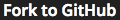

# Using GitHub
Unlike other platforms, if you want to work on codecheck challenges in your local environment,  
you can!  

## Requirements
- <a href="https://github.com/join" target="_blank"> GitHub account</a>
- <a href="https://git-scm.com/" target="_blank">Git</a> (If you don't know Git, see <a href="https://try.github.io/" target="_blank">this</a> and <a href="https://git-scm.com/doc" target="_blank">this</a>.)
- <a href="https://nodejs.org/en/download/" target="_blank">Node.js/npm</a>
- <a href=
"https://app.code-check.io/settings/social" target="_blank">Connect your GitHub account</a> to code-check.io.
- Finally, chant `npm install codecheck` in the CLI to summon codecheck.
- Also: Any other dependencies specified in the challenge's README.md

## Setup


- **Complete all requirements**.
- Click the  Button.
- Fill out the repository name and click the "OK" button.
- Click the link to jump to the generated GitHub repository page.
- Copy the repo link from the "Clone or Download" menu.
- Go to your CLI and `git clone {REPO NAME}` to copy the repository to your local directory.
- Now, just launch your favorite IDE/editor and crush that challenge!

## Running the Tests

- Once you're ready to test your code, run `codecheck` from your CLI.
- The test results will print to stdout like this:
```
$ codecheck
codecheck version 0.5.3
chai@2.3.0 node_modules/chai
├── assertion-error@1.0.0
└── deep-eql@0.1.3 (type-detect@0.1.1)
Finish build: npm install (1966ms)
////////////////
Output from the test executable
////////////////
codecheck: Finish with code 9
codecheck: tests  : 9
codecheck: success: 0
codecheck: failure: 9
```

## Saving your Solution
- Commit your changes to master (See the <a href="https://git-scm.com/book/en/v2/Git-Basics-Recording-Changes-to-the-Repository" target="_blank">git docs</a> if necessary).
- Save your answer by pushing to remote master with `git push origin master`.
- If successful, your answer is also simultaneously saved to the codecheck server.  
- Confirm that the status of the challenge changes from "In Progress" to "Saved" in the challenge details page.

## Submitting your Solution
- Once you're ready to submit, save your changes following the above instructions.
- Go to the challenge details page and click .
- You're done! Yaaay!
