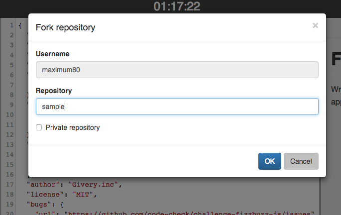

# Using GitHub
If you want to work on codecheck challenges in your local environment, you can!  
First you'll need a [github account](https://github.com/join).  
Then, [connect your GitHub account](https://app.code-check.io/settings/social) to codecheck before you start the challenge.

## Solving with GitHub
### Fork challenge
This menu appears when you click the "Fork" button.
  
Fill out the repository name and click the "OK" button, then you are going to jump to the generated repository page.  
Check "Private Repository" if you do not want to publish the repository.

### Clone repository
   
Clone your challenge repo with the standard `git clone`:

```
$ git clone {GIT_URL}
```
Now, you can hack Challenges in your own local environment!

### Save answer
Save your answer by pushing your branch to remote master.

```
$ git push origin master
```
The answer is also simultaneously saved to the codecheck server.  
Please confirm that the state of challenge changes from "In Progress" to "Saved" in the exam details page.

That's it!
