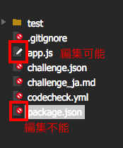

# Webエディタの使い方

## ファイルの編集

### ファイルの種類
  
Webエディタ内の左側にはファイルツリーが表示されます。  
アイコンの種類によって、編集可能なファイルとそうでないファイル（編集不能）を見分けることが出来ます。  
問題文に従って、指定のファイルを編集するようにしてください。

### エディタの設定
  
左上のセッティングアイコンをクリックすると、  
* エディタのカラーテーマ
* TABキーの半角スペース変換
* HTMLビューワーのプレビュー方法（オートプレビュー）
* ファイルの保存時のダイアログの表示設定
等の設定をすることが出来ます。

## 実行について
### テストの実行
Webエディタ右下の「RUN」ボタンでテストを実行することが可能です。  
テストの結果と同時に、出力結果が返されます。

- テストコードについて
  - codecheckでは、テストはテストフレームワークを用いたUnitテストとして実行されます。
  - ここでいう「テスト」とは、各問題ごとに設定されているプログラムが正しいかどうかを判定するテストコードの事を指します。
  - テストコードは受験者に公開しているものはファイルを確認することが出来ます。

### プレビュー
プレビューはHTML、CSS、Javascriptで構成されたアプリケーションのビューワーとして表示させるものです。設定上でオートプレビューをオンにしていると、リロードすることなく、編集内容がプレビューに反映されます。

### 保存方法
編集内容の保存をするためには、画面右上の「SAVE」ボタンをクリックしてください。  
  
ボタンをクリックすると、編集したファイルが一覧で表示されます。  
保存したいファイルを選択してOKボタンをクリックすると、ファイルが保存されます。

### ブラウザについて
[推奨ブラウザ](reference.md)を一読ください。
