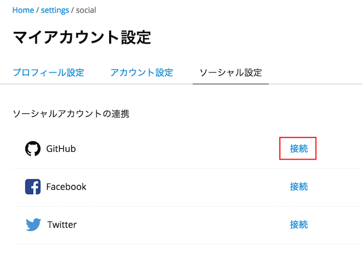
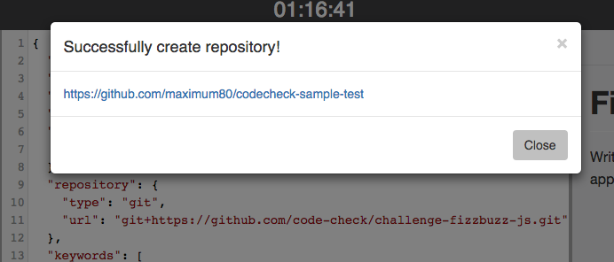
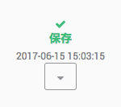

# GitHubを利用した受験方法
codecheckでは、GitHubと連携することで
ローカル環境で問題を回答することが可能です。  
※GitHub受験が可能な問題のみが対象です。


## 必須条件
- <a href="https://github.com/join" target="_blank">Githubアカウントが必要です</a>
- <a href="https://git-scm.com/" target="_blank">Git</a> (Gitの使い方は[こちらを](https://git-scm.com/book/ja/v2)を参照してください。)


## GitHubアカウントの連携

**必須条件を事前に終えてください**。

まず、GitHubを活用して回答をする場合、codecheck内でGitHubアカウントの連携が必要です。  
[こちらのページ](https://app.code-check.io/settings/social)から、GitHubアカウントの連携をおこないます。



こちらの「接続」をクリックし、GitHubのアカウントの連携をしてください。  
アカウントの連携が完了しましたら、再度こちらの画面をリロードしてください。  
正しく接続が完了すると、"GitHubで解く"ボタンが選択できるようになります。


## チャレンジをフォークしてみましょう

Webエディタにてチャレンジを開いた後、エディタ左上のフォークボタンをクリックしてください。  
![フォークボタン]](images/s7.png)

ダイアログが立ち上がったら、リポジトリ名を入力して、作成を選択してみましょう。  


すると、GitHubの生成されたリポジトリURLが表示されます。



表示されたURLをクリックすると、生成されたGitHubのページにジャンプすることが出来ます。


## ファイルの編集
GitHubを使って回答の編集をしてみましょう。  
ローカルにクローンをすれば、自分自身の好きな環境やエディタで自由に回答を編集することも可能です。  
今回は、`answer.md`を編集してみましょう。  


## 回答のPush
回答を編集したら、編集内容をcodecheck上に保存します。  
リモートのmasterにプッシュ(`git push origin master`)するだけで、回答内容をcodecheck上に保存する事ができます。  
無事にリモートのmasterにプッシュが完了すると、codecheck側にもmasterの編集内容が保存されます。  
masterにpushした後、チャレンジの詳細画面に戻ってください。  
「保存」の下に表示されている時間が、pushをした時間に切り替わっていれば、正しく保存が完了しています。  




## 保存されているかの確認
保存が完了したら、正しく保存ができているのか、改めてWebエディタで確かめてみましょう。  
Webエディタ画面を再度開いてみてください。(既に開いている場合はリロード)  
編集したファイルが正しく保存され、更新されていれば完了です。  
また、画面右上のSAVEボタンが押せなくなっており"READONLY Solving in GitHub"と表示されます。  
**一度GitHubで受験をし、ローカルから保存をすると、Webエディタからは編集・保存ができなくなるので、ご注意下さい**

また、Webエディタ上で`answer.md`を開いてみましょう。
あなたがローカルで編集した内容が反映されたら成功です。  

最後に、テスト実行ボタンを押してみましょう。
```
codecheck: Finish 'npm install with code 0
1..2
ok 1 helloWorld Hello World!
# tests 2
# pass 2
# fail 0
codecheck: Finish with code 0
codecheck: tests  : 2
codecheck: success: 2
codecheck: failure: 0
```

が表示されたら正しく解答ができていることになります。  
このように、GitHub上で受験・保存をした後も、codecheck上でテストを実行し、結果を確かめることが可能です。


## チャレンジを提出しよう
### answer.mdの表示とコメント
codecheckでは、あなたが工夫して解答した点を`answer.md`にまとめることが出来ます。
こちらのファイルを開いて、指定されている質問に回答してみましょう。  
こちらのファイル内容は企業側が閲覧します。自由に自身のエンジニアスキルを表現してみてください。  

### チャレンジの提出
全ての解答内容の保存が確認できたら、解答を提出しましょう。
チャレンジの詳細画面に戻り、画面右上の「提出（submit）」ボタンを押して「OK」をクリックすると、提出が完了します。  
一度提出をすると、変更や再受験は出来ませんので、ご注意ください。
