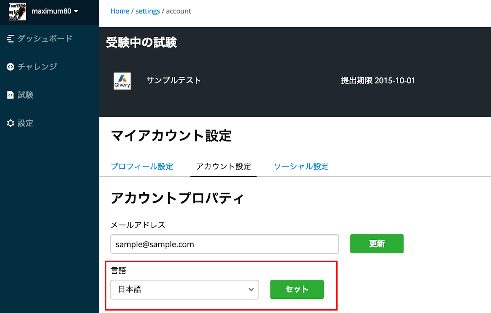
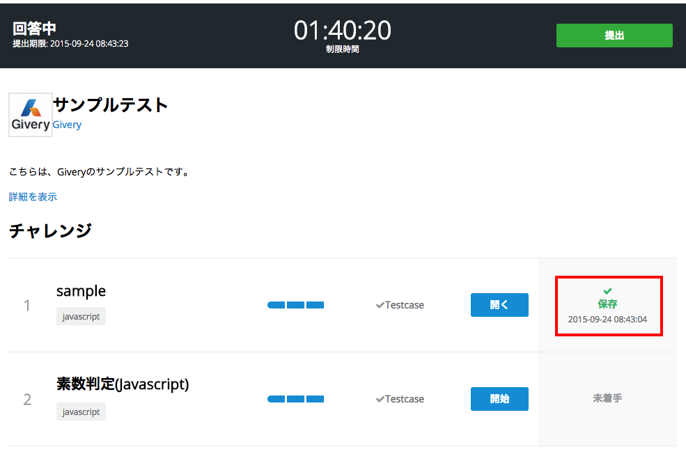

# codecheckドキュメンテーション
codecheckのドキュメンテーションにようこそ！

## codecheckとは

codecheckとは、実践的なプログラミング問題をオンラインエディタやGitHubと連携して問題を回答するプログラミング試験サービスです。

## 使い方

- まずは[ユーザー登録](https://app.code-check.io/auth/signup)をしてください
- 次に、[サンプル問題](https://app.code-check.io/orgs/codecheck/challenges/77)を解答してみてください。

- また、Web Editorの詳細の操作は[Web Editorの使い方](guide_web_editor.md)を参考にしてください。

- 問題によっては、Github活用して[ローカル環境でチャレンジ](guide_github.md)するケースもございます。

---

#### 言語設定の変更
言語設定の変更は設定内のアカウントセッティングから行うことが出来ます。
プルダウンを日本語に切り替えて「セット」ボタンをクリックすると設定が反映されます。

#### ソーシャルアカウント（GitHubアカウント）の追加
codecheckは、GitHubを活用してチャレンジを回答することが出来ます。  
しかし、その場合は、お持ちのGitHubアカウントを連携する必要があります。
設定->ソーシャル設定  
に移動して以下の接続というリンクをクリックしてください。
  
GitHubにアクセスしてアプリの連携承認後、codecheck内に戻ってアカウント名が表示されていれば成功です。

#### 回答内容の確認
回答した内容を提出します。提出する回答は、回答内容を一度は「Save（保存）」をしたもののみになります。
  
上記のように、ステータスが「保存」となっているかどうかを確認してください。
「作業中」ものは編集中ですが保存はされていません。制限時間が懲戒した際等、回答内容は提出されませんので、必ず「保存」をするようにしてください。

#### 回答の提出
回答の提出は、試験中の画面右上の「提出」ボタンをクリックすることでおこなわれます。
改めて、回答したチャレンジが「保存」となっているかどうか提出前に確かめておきましょう。

#### 制限時間超過の場合
制限時間が超過した場合は、自動的に「保存」されている問題が回答として提出されます。
必ず制限時間内に「保存」した回答内容を「提出」するように心がけましょう。
